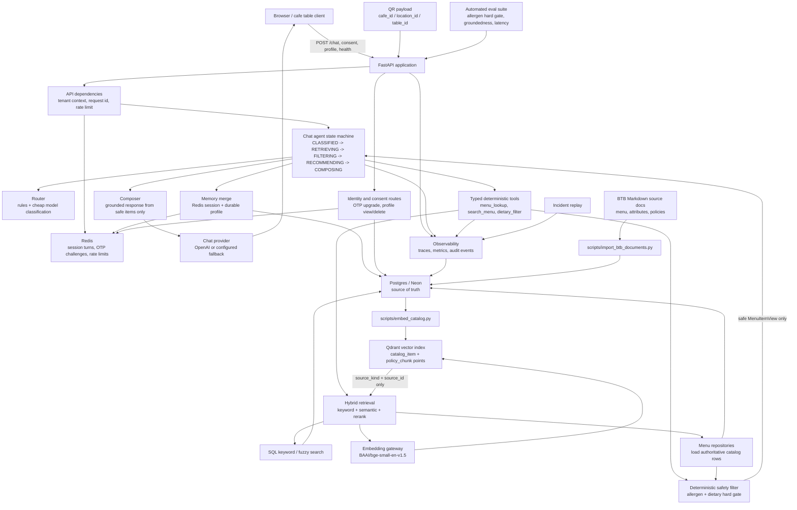

# Cafe Assistant

Production-oriented Python backend for a cafe menu assistant with deterministic
allergen and dietary safety filtering, hybrid menu retrieval, a safety-gated
streaming chat agent, consent-gated durable memory, tenant isolation, audit
logging, observability, automated evals, and release artifacts.

The most important rule in this system is simple:

> The model never decides dietary or allergen safety. It only explains or ranks
> items that have already passed deterministic safety checks.

## Contents

- [System Status](#system-status)
- [Architecture](#architecture)
- [Safety Model](#safety-model)
- [Repository Layout](#repository-layout)
- [Technology Stack](#technology-stack)
- [Local Development](#local-development)
- [Configuration](#configuration)
- [Database](#database)
- [Catalog Import and Embeddings](#catalog-import-and-embeddings)
- [API Surface](#api-surface)
- [Chat Agent Flow](#chat-agent-flow)
- [Identity and Memory](#identity-and-memory)
- [Security and Governance](#security-and-governance)
- [Observability](#observability)
- [Evaluation Suite](#evaluation-suite)
- [Testing and Quality Gates](#testing-and-quality-gates)
- [Deployment](#deployment)
- [Operations](#operations)
- [Development Notes](#development-notes)

## System Status

Implemented phases:

| Phase | Area | Status |
| --- | --- | --- |
| 0 | FastAPI, config, async SQLAlchemy, Alembic, Postgres, Redis, seed data | Implemented |
| 1 | Deterministic dietary/allergen safety filter | Implemented |
| 2 | Exact, fuzzy, vector, and hybrid menu retrieval | Implemented |
| 3 | Streaming chat agent with explicit state machine | Implemented |
| 4 | QR tenant context, device identity, OTP consent, durable profile memory | Implemented |
| 5 | Tenant scoping, rate limiting, injection defenses, audit, redaction | Implemented |
| 6 | Tracing, metrics, eval hard gates, incident replay, CI | Implemented |
| 7 | Version registry, deploy artifacts, load/chaos tests, runbook | Implemented |

The production data path uses Postgres/Neon as the relational source of truth
and Qdrant as the semantic vector index. Tests and safety evals keep providers
mockable so they run without external model or vector-store calls.

## Architecture

### Runtime Components

The diagram below shows the full production shape of the system. The important
boundary is that Qdrant and retrieval only produce candidate IDs; SQL remains the
source of truth, and every menu path crosses the deterministic safety filter
before the LLM composer sees an item.



How to read the diagram:

- **Postgres/Neon is authoritative.** It stores tenants, catalog rows, policy
  chunks, allergen/dietary assertions, profiles, consents, and audit events.
- **Qdrant is only an index.** It stores vectors plus `tenant_id`, `source_kind`,
  and `source_id`; the app reloads real rows from SQL before using content.
- **Redis is operational state.** It stores short-lived session turns, OTP
  challenges, and rate-limit counters.
- **The safety filter is the hard gate.** Retrieval, exact lookup, and fallback
  paths return only `MenuItemView` records that passed deterministic filtering.
- **The LLM sees safe items only.** It may explain or phrase recommendations,
  but it never decides allergen or dietary safety.

### Package Map

| Path | Responsibility |
| --- | --- |
| `src/cafe_assistant/main.py` | FastAPI application factory and route registration |
| `src/cafe_assistant/config.py` | Environment-driven settings via `pydantic-settings` |
| `src/cafe_assistant/db/` | SQLAlchemy models, async engine/session, repositories |
| `src/cafe_assistant/domain/dietary.py` | Pure deterministic allergen and dietary safety filter |
| `src/cafe_assistant/retrieval/` | Embedding text, Qdrant/pgvector search, keyword search, hybrid fusion |
| `src/cafe_assistant/gateway/model_gateway.py` | Mockable embedding and chat provider abstractions |
| `src/cafe_assistant/agent/` | Router, typed tools, custom FSM, composer, prompts |
| `src/cafe_assistant/memory/` | Redis session memory, durable profile merge, write gate |
| `src/cafe_assistant/identity/` | QR tenant context, device token, OTP upgrade flow |
| `src/cafe_assistant/security/` | Rate limiting, prompt-injection neutralization, audit, redaction |
| `src/cafe_assistant/observability/` | Tracing, metrics, incident replay |
| `evals/` | Safety and quality evaluation datasets and runners |
| `deploy/` | Containerfile, production Compose, Kubernetes manifests, release scripts |
| `tests/` | Unit, integration, chaos, and load tests |
| `scripts/` | Seed, embedding backfill, retention cleanup, incident replay helpers |

### Request Path

1. `api/deps.py` resolves tenant context from either `tenant_id` or QR payload.
2. Redis-backed rate limits are checked by session id and client IP.
3. `agent/router.py` classifies the message using rules and a cheap model path.
4. `retrieval/hybrid.py` combines keyword and semantic retrieval.
5. `domain/dietary.py` filters candidates deterministically.
6. The composer receives only the safe item set.
7. The response streams through `POST /chat` as server-sent events.
8. Significant actions are redacted and appended to `audit_events`.
9. Metrics and trace attributes are recorded for debugging and release gates.

## Safety Model

Safety is intentionally deterministic and conservative.

Hard invariants:

- No LLM call decides allergen or dietary safety.
- No unsafe item should appear in the model context.
- Unknown allergen data is unsafe when the customer has any active allergen
  avoidance.
- `menu_items.allergen_data_complete` is explicit. The system never infers
  completeness from ingredient rows.
- Allergen avoidances and dietary modes are hard exclusions.
- Sugar and carb preferences are soft ranking signals only. They never exclude
  items and are never medical advice.
- Medical questions are refused/escalated with a short not-medical-advice note.
- An empty safe set is valid. The assistant must say it cannot confirm a safe
  option and suggest checking with staff.

The core safety function is:

```python
filter_safe_items(items, restrictions) -> FilterResult
```

It returns both `safe_items` and per-item decisions such as:

- `INCLUDED`
- `EXCLUDED_ALLERGEN_PEANUT`
- `EXCLUDED_INCOMPLETE_DATA`
- `EXCLUDED_NOT_VEGAN`
- `EXCLUDED_NOT_VEGETARIAN`
- `EXCLUDED_NOT_GLUTEN_FREE`

## Repository Layout

```text
.
|-- alembic.ini
|-- docker-compose.yml
|-- pyproject.toml
|-- README.md
|-- RUNBOOK.md
|-- deploy/
|-- evals/
|-- migrations/
|-- scripts/
|-- src/
|   `-- cafe_assistant/
|-- static/
|-- tests/
`-- uv.lock
```

Generated or local-only files such as `.env`, `.venv/`, `__pycache__/`, and test
caches should not be committed.

## Technology Stack

- Python 3.12
- FastAPI
- SQLAlchemy 2.0 async ORM, declarative typed models
- Alembic
- PostgreSQL 16 with `pgvector`
- Redis
- pydantic-settings
- pytest, pytest-asyncio, httpx
- Ruff
- Docker Compose for local infrastructure
- Kubernetes and production Compose deployment artifacts

## Local Development

### Prerequisites

- Python 3.12
- `uv`
- Docker Desktop or compatible Docker runtime
- PowerShell, Bash, or another shell capable of running the commands below

### 1. Create Environment File

```bash
cp .env.example .env
```

On PowerShell:

```powershell
Copy-Item .env.example .env
```

For local development, the default `.env.example` values are enough.
The default embedding provider is Sentence Transformers using
`BAAI/bge-small-en-v1.5`; the first embedding run may download the model from
Hugging Face.

### 2. Install Dependencies

```bash
uv sync --extra dev
```

This creates or updates the local virtual environment. Do not commit `.venv/`.

### 3. Start Local Infrastructure

```bash
docker compose up -d
```

This starts:

- PostgreSQL 16 with `pgvector`
- Redis 7

If `.env` points `DATABASE_URL` at Neon, Docker Postgres is not required.
Redis is still required for chat/session/rate-limit features unless you point
`REDIS_URL` at a managed Redis instance.

Check rendered Compose config:

```bash
docker compose config
```

### 4. Run Migrations

```bash
uv run alembic upgrade head
```

To render SQL without applying it:

```bash
uv run alembic upgrade head --sql
```

### 5. Import BTB Catalog

```bash
uv run python scripts/import_btb_documents.py
```

This reads the Markdown source documents under `docs/source/by-the-brew/` and
loads the normalized menu, variants, ingredients, allergen assertions, dietary
assertions, and policy chunks into Postgres/Neon.

### 6. Backfill Embeddings

```bash
uv run python scripts/embed_catalog.py
```

With `VECTOR_PROVIDER=qdrant`, this creates or validates the configured Qdrant
collection and upserts catalog/policy vectors there. Qdrant stores candidate
IDs and payload metadata only; Postgres/Neon remains the source of truth.

### 7. Run the API

```bash
uv run uvicorn cafe_assistant.main:app --reload
```

Health check:

```bash
curl http://localhost:8000/health
```

Expected response:

```json
{"status":"ok"}
```

Open the minimal chat page:

```text
http://localhost:8000/chat
```

## Configuration

Settings are loaded from environment variables by `src/cafe_assistant/config.py`.
The app also reads `.env` locally.

| Variable | Default | Purpose |
| --- | --- | --- |
| `APP_NAME` | `Cafe Assistant` | FastAPI application name |
| `ENVIRONMENT` | `local` | Runtime environment label |
| `DATABASE_URL` | local Postgres URL | Async SQLAlchemy database URL |
| `REDIS_URL` | `redis://localhost:6379/0` | Redis connection URL |
| `EMBEDDING_PROVIDER` | `sentence_transformer` | Embedding provider adapter |
| `EMBEDDING_MODEL_NAME` | `BAAI/bge-small-en-v1.5` | Sentence Transformers embedding model |
| `EMBEDDING_DIMENSION` | `384` | Embedding vector dimension |
| `VECTOR_PROVIDER` | `qdrant` | Semantic vector index provider |
| `QDRANT_URL` | empty | Qdrant cluster URL |
| `QDRANT_ENDPOINT` | empty | Alias for `QDRANT_URL` |
| `QDRANT_API_KEY` | empty | Qdrant API key |
| `QDRANT_COLLECTION` | `cafe_assistant_menu_policy` | Qdrant collection for menu and policy vectors |
| `LLM_PROVIDER` | `openai` | Provider used when chat provider is `llm`, `default`, or `configured` |
| `LLM_MODEL` | `gpt-4o-mini` | Intended chat model label |
| `LLM_API_KEY` | empty | Local secret for the real chat provider once enabled |
| `CHEAP_CHAT_PROVIDER` | `local` | Classification provider; set to `llm` to use `LLM_PROVIDER` |
| `STRONG_CHAT_PROVIDER` | `local` | Synthesis provider; set to `llm` to use `LLM_PROVIDER` |
| `CHAT_TIMEOUT_SECONDS` | `8.0` | Total gateway deadline across retries and fallback |
| `CHAT_RETRIES` | `1` | Retry count for retryable provider failures |
| `AGENT_DEADLINE_SECONDS` | `12.0` | Per-request agent deadline |
| `AGENT_MAX_TOOL_CALLS` | `4` | Tool-call budget |
| `IDENTITY_PHONE_HASH_SECRET` | local secret | Salt/secret for phone hashing |
| `DEVICE_TOKEN_BYTES` | `32` | Opaque browser token size |
| `OTP_CODE_TTL_SECONDS` | `300` | OTP challenge TTL |
| `RATE_LIMIT_SESSION_REQUESTS` | `60` | Session request limit |
| `RATE_LIMIT_SESSION_WINDOW_SECONDS` | `60` | Session rate-limit window |
| `RATE_LIMIT_IP_REQUESTS` | `120` | IP request limit |
| `RATE_LIMIT_IP_WINDOW_SECONDS` | `60` | IP rate-limit window |
| `RATE_LIMIT_HASH_SECRET` | local secret | HMAC secret for Redis rate-limit keys |
| `PROFILE_RETENTION_DAYS` | `365` | Durable profile retention window |
| `SESSION_RETENTION_DAYS` | `14` | Session/event retention window |
| `AUDIT_RETENTION_DAYS` | `730` | Audit retention window |
| `OBSERVABILITY_ADMIN_TOKEN` | local token | Admin token required for metrics and replay |
| `OBSERVABILITY_TRACE_STORE_PATH` | `var/observability/traces.jsonl` | Durable redacted JSONL trace spool for replay |
| `TRACE_STORE_MAX_TRACES` | `500` | In-memory trace cache size per worker |
| `METRICS_LATENCY_SAMPLE_LIMIT` | `2000` | Bounded latency samples retained per metric series |
| `LANGFUSE_ENABLED` | `false` | Enable Langfuse integration |
| `LANGFUSE_PUBLIC_KEY` | empty | Langfuse public key |
| `LANGFUSE_SECRET_KEY` | empty | Langfuse secret key |
| `LANGFUSE_HOST` | Langfuse cloud URL | Langfuse host |
| `DEFAULT_CHAT_MODEL_NAME` | `gpt-4o-mini` | Trace label for default model |
| `LATENCY_BUDGET_MS` | `1500` | Eval/load latency budget |

Production environments must replace local secrets and should provide
configuration through environment variables or secret managers, not committed
files.

## Database

The relational database is the source of truth. Qdrant is only an index over
menu and policy data. Search results from Qdrant are treated as candidate IDs;
the app always reloads the real rows from Postgres/Neon before safety filtering.

Core schema:

- `tenants`
- `locations`
- `menu_items`
- `ingredients`
- `item_ingredients`
- `allergens`
- `ingredient_allergens`
- `dietary_tags`
- `item_dietary_tags`
- `customers`
- `customer_profile`
- `episodic_events`
- `consents`
- `device_tokens`
- `audit_events`

Important menu columns:

- `menu_items.allergen_data_complete`: explicit boolean safety flag. If false
  and the customer has allergen avoidance, the item is excluded.
- `catalog_items.allergen_data_complete`: same safety contract for production
  catalog rows.
- `catalog_items.dietary_data_complete`: explicit boolean for dietary-mode
  completeness.

Vector storage:

- Qdrant collection: `cafe_assistant_menu_policy`
- Catalog point payload includes `tenant_id`, `source_kind=catalog_item`,
  `source_id=<catalog_item_variant.id>`, and `menu_version_id`.
- Policy point payload includes `tenant_id`, `source_kind=policy_chunk`,
  `source_id=<policy_chunks.id>`, and `policy_document_id`.
- pgvector columns still exist as a fallback/legacy path, but Qdrant is the
  configured semantic index when `VECTOR_PROVIDER=qdrant`.

Migration chain:

| Revision | Purpose |
| --- | --- |
| `20260616_0001_initial_schema.py` | Initial menu schema and pgvector extension |
| `20260617_0002_menu_item_embeddings.py` | Menu item embedding column |
| `20260618_0003_identity_memory.py` | Customer, profile, consent, episodic memory, device token tables |
| `20260618_0004_security_audit.py` | Append-only audit event table |
| `20260619_0005_production_catalog.py` | Source docs, catalog, variants, policies, modifiers |
| `20260619_0006_sentence_transformer_embeddings.py` | 384-dimensional BGE embedding compatibility |

Run migrations:

```bash
uv run alembic upgrade head
```

Create a new migration after model changes:

```bash
uv run alembic revision --autogenerate -m "describe change"
```

Always inspect generated migrations before applying them.

## Catalog Import and Embeddings

Import the production BTB source documents:

```bash
uv run python scripts/import_btb_documents.py
```

The importer reads the Markdown source files, fingerprints the content, and
loads a versioned catalog into Postgres/Neon. It preserves explicit allergen
completeness: unknown allergen data stays unknown and is treated as unsafe by
the safety filter.

Backfill catalog and policy embeddings:

```bash
uv run python scripts/embed_catalog.py
```

Embedding text is built from catalog item names, descriptions, variants,
dietary/allergen metadata, and policy chunks. With the Qdrant provider enabled,
embeddings are stored in the configured Qdrant collection while Postgres/Neon
remains the source of truth.

### Import BTB Source Documents

The By The Brew Markdown files live under:

```text
docs/source/by-the-brew/
```

Import them into the production catalog substrate:

```bash
uv run python scripts/import_btb_documents.py
```

This registers the Markdown files as `source_documents`, creates a
`menu_import_batch`, builds a versioned published menu, parses item variants,
ingredients, allergen/dietary assertions, modifiers, and policy chunks, and
keeps the raw documents traceable by content hash.

To stage without publishing:

```bash
uv run python scripts/import_btb_documents.py --staged
```

Backfill embeddings for the published catalog variants and policy chunks:

```bash
uv run python scripts/embed_catalog.py
```

For one tenant only:

```bash
uv run python scripts/embed_catalog.py --tenant-id 1
```

Production retrieval prefers published catalog variants and their vector index.
If a tenant has no published catalog yet, retrieval falls back to the legacy
`menu_items` seed schema.

## API Surface

### Health

```http
GET /health
```

Returns:

```json
{"status":"ok"}
```

### Chat

```http
POST /chat
```

Request body:

```json
{
  "session_id": "demo-session",
  "tenant_id": 1,
  "device_token": null,
  "message": "I am allergic to peanuts. What pastry can I have?"
}
```

The endpoint streams server-sent events:

```text
data: {"token":"..."}

event: done
data: {}
```

Response headers include:

- `X-Request-ID`
- `X-Trace-ID`

### Chat Page

```http
GET /chat
```

Serves `static/chat.html`, a minimal vanilla JavaScript chat client.

### Identity and Consent

```http
POST /identity/otp/start
POST /identity/otp/confirm
GET /identity/profile
DELETE /identity/profile
```

The OTP flow upgrades an anonymous session to a remembered profile only after
explicit customer consent. Profile read and deletion are tenant scoped.

### Observability

```http
GET /metrics?tenant_id=<tenant_id>
GET /metrics/openmetrics?tenant_id=<tenant_id>
GET /observability/replay/{trace_id}?tenant_id=<tenant_id>
X-Admin-Token: <OBSERVABILITY_ADMIN_TOKEN>
```

`/metrics` returns JSON reliability, quality, latency, and estimated cost metrics.
`/metrics/openmetrics` returns the same process metrics in a scrape-friendly
OpenMetrics text format. Replay reconstructs redacted trace details from memory or
the durable JSONL trace spool, but only for traces owned by the request tenant
and only after admin-token validation.

## Chat Agent Flow

The agent is a single custom finite state machine with these states:

```text
CLASSIFIED -> RETRIEVING -> FILTERING -> RECOMMENDING -> COMPOSING -> COMPLETE
```

Additional terminal states:

- `ESCALATED`
- `FAILED`

The state machine enforces:

- per-request deadline
- maximum tool-call budget
- medical refusal path
- empty-safe-set fallback
- memory-unavailable fallback
- recommender-unavailable fallback

Tools are typed and exposed through `agent/tools.py`:

- `menu_lookup`
- `search_menu`
- `dietary_filter`

The composer receives only `safe_items`. It never receives the raw menu.

## Identity and Memory

Identity degrades gracefully:

1. Device token hit: recognized customer profile is loaded.
2. Device token miss: request continues as an anonymous session.
3. Redis/session unavailable: request continues as an anonymous session.

Tenant context is stamped from either:

- a direct `tenant_id`, useful for development and tests
- a QR payload containing only cafe/location/table context

QR payloads must never contain user identity or secrets.

Durable memory rules:

- UI preferences, such as milk preference, may be auto-written for recognized
  customers.
- Dietary or health facts, such as allergies or diabetic mentions, require
  explicit OTP consent before durable persistence.
- Current message instructions override stored memory for the active turn.
- Customer profiles are tenant scoped. Cross-tenant reads are denied by design.

## Security and Governance

Security controls:

- Every data-bearing request requires tenant context.
- All data access is tenant scoped in repositories and API dependencies.
- Redis-backed rate limits apply per tenant/session and per tenant-scoped IP.
- Rate-limit Redis keys store HMAC digests, not raw session IDs or IP addresses.
- User text and menu text are treated as untrusted.
- Prompt-injection-like phrases are neutralized before model/provider calls.
- System instructions and retrieved data are kept separated.
- Logs and audit payloads redact phone numbers, health terms, auth headers,
  cookies, OTP details, provider keys, tokens, and secrets.
- Significant actions append redacted rows to `audit_events`.
- App code provides no update/delete path for audit events.

Governed actions written to audit:

- recommendation served
- profile read
- profile write
- consent granted
- profile deleted

Retention cleanup:

```bash
uv run python scripts/cleanup_retention.py --dry-run
uv run python scripts/cleanup_retention.py
# Privileged governance-only audit purge:
uv run python scripts/cleanup_retention.py --purge-audit-events
```

## Observability

Tracing records request and model-related attributes including:

- tenant id
- request id
- trace id
- route and classification confidence
- prompt version
- tool name
- retrieved item ids
- safe item ids
- model/provider name
- token/cost estimates where available
- component version registry

The version registry tracks:

- prompts
- tools
- retrievers
- embedding model
- model choices
- policy rules
- memory write rules
- orchestrator graph

Replay a trace through the API:

```bash
curl -H "X-Admin-Token: $OBSERVABILITY_ADMIN_TOKEN" "http://localhost:8000/observability/replay/<trace_id>?tenant_id=1"
```

Replay a trace from the local durable JSONL spool:

```bash
uv run python scripts/incident_replay.py <trace_id>
```

Replay a deployed trace through the secured API:

```bash
uv run python scripts/incident_replay.py <trace_id> --base-url http://localhost:8000 --tenant-id 1 --admin-token "$OBSERVABILITY_ADMIN_TOKEN"
```

Langfuse is configurable through environment variables and disabled by default.
Langfuse export failures are counted as observability failures without blocking
customer requests. Tests run against no-op/local observability behavior.

## Evaluation Suite

The evaluation suite contains realistic and adversarial cases:

- allergen avoidance
- semantically similar unsafe items
- incomplete allergen data
- vegan, vegetarian, and gluten-free modes
- conflicting user instructions
- prompt-injection strings
- medical questions
- empty-safe-set situations
- groundedness checks
- relevance checks
- latency budget checks

Run all evals:

```bash
uv run python evals/run_evals.py
```

Run the hard allergen-safety gate only:

```bash
uv run python evals/allergen_safety.py
```

The allergen safety gate fails if false negatives are greater than zero.

## Testing and Quality Gates

Run the full test suite:

```bash
uv run pytest -q
```

Run lint:

```bash
uv run ruff check . --no-cache
```

Run load tests included in pytest:

```bash
uv run pytest tests/load -q
```

Run chaos tests:

```bash
uv run pytest tests/chaos -q
```

Optional k6 script:

```bash
k6 run tests/load/k6_chat.js
```

Expected release checks:

```bash
uv run ruff check . --no-cache
uv run pytest -q
uv run python evals/run_evals.py
uv run alembic upgrade head --sql
docker compose config
```

The CI workflow runs lint, tests, and evals. Allergen safety is a hard gate.

## Deployment

Deployment artifacts live in `deploy/`.

### Container

```bash
docker build -f deploy/Containerfile -t cafe-assistant:local .
```

### Production Compose

Production Compose requires a non-empty Postgres password:

```bash
POSTGRES_PASSWORD=replace-me docker compose -f deploy/docker-compose.prod.yml config
POSTGRES_PASSWORD=replace-me docker compose -f deploy/docker-compose.prod.yml up -d
```

Production Compose includes:

- API service
- retention cleanup worker
- Postgres with pgvector
- Redis
- health checks
- resource limits

### Kubernetes

Manifests live in `deploy/k8s/`:

- namespace
- config map
- secret example
- Postgres and Redis
- stable and canary API deployments
- service
- cleanup worker

Apply manifests:

```bash
kubectl apply -f deploy/k8s/
```

### Release, Canary, Promotion, Rollback

Start canary:

```bash
IMAGE=ghcr.io/org/cafe-assistant:<tag> deploy/release.sh
```

Run shadow traffic:

```bash
TARGET_URL=http://<canary-url> TENANT_ID=1 uv run python deploy/shadow_traffic.py
```

Promote:

```bash
IMAGE=ghcr.io/org/cafe-assistant:<tag> deploy/promote.sh
```

Rollback:

```bash
deploy/rollback.sh
```

See `RUNBOOK.md` for the full incident and release playbook.

## Operations

### Health Check

```bash
curl http://localhost:8000/health
```

### Metrics

```bash
curl -H "X-Admin-Token: $OBSERVABILITY_ADMIN_TOKEN" "http://localhost:8000/metrics?tenant_id=1"
```

### Trace Replay

```bash
curl -H "X-Admin-Token: $OBSERVABILITY_ADMIN_TOKEN" "http://localhost:8000/observability/replay/<trace_id>?tenant_id=1"
```

### Retention Cleanup

```bash
uv run python scripts/cleanup_retention.py --dry-run
uv run python scripts/cleanup_retention.py
# Privileged governance-only audit purge:
uv run python scripts/cleanup_retention.py --purge-audit-events
```

### Incident Response

Use `RUNBOOK.md` for:

- how to read a trace
- how to replay an incident
- safety incident triage
- rollback steps
- launch gate checklist
- ownership/page guidance

## Development Notes

- Keep business logic out of migrations and scripts unless it is one-time data
  setup.
- Keep the safety filter pure, deterministic, and free of network calls.
- Keep model providers behind gateway protocols so tests can inject fakes.
- Do not let LLM output bypass `filter_safe_items`.
- Do not persist health or dietary facts without consent.
- Do not log raw phone numbers, health facts, tokens, or secrets.
- Do not commit `.env`, `.venv/`, database volumes, caches, or generated local
  files.

Before opening a pull request or pushing a release branch, run:

```bash
uv run ruff check . --no-cache
uv run pytest -q
uv run python evals/run_evals.py
```
